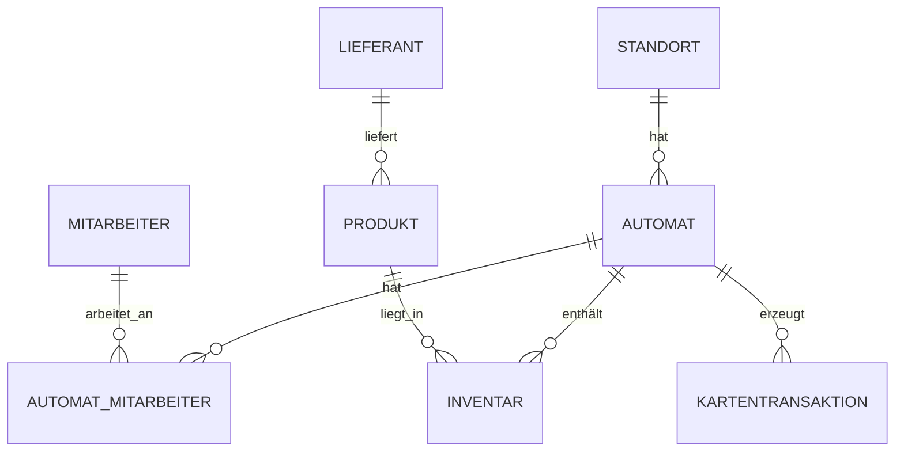

## Einleitung

Dieses Skript ist von Herrn Vöhringer für den SAE Unterricht im 2. Lehrjahr der Fachinformatiker an der Gewerbreschule Villingen-Schwenningen.

Es ist eine Ergänzung zum Unterricht und gleichzeitig eine kompakte Zusammenfassung für Klassenarbeiten und Prüfungen, ist aber in keinster Weise vollständig. Es basiert auf der Warenautomat-Datenbank.

Die Datenbank bildet einen Verkaufsautomaten-Betrieb ab. Zentrales Element sind die Verkaufsautomaten, die an verschiedenen Standorten stehen und von Mitarbeitern betreut werden. In jedem Automaten befinden sich ein Inventar aus Produkten, die von Lieferanten eingekauft werden.

### Überblick über die Warenautomat-Datenbank

Das Diagramm zeigt die wichtigsten Beziehungen: Ein Standort kann mehrere Automaten haben, ein Lieferant kann mehrere Produkte liefern, und Automaten sowie Mitarbeiter oder Produkte werden über Zwischentabellen bzw. Fremdschlüssel verbunden.

### Themenübersicht und Querverweise

Die Kapitel bauen inhaltlich aufeinander auf. Die komplette Navigation findest du jetzt links in der Seitenleiste und unten über die Kapitel-Links.

Wenn du direkt zur Gesamtübersicht zurückspringen willst, nutze [die Startseite]({{ '/' | relative_url }}).