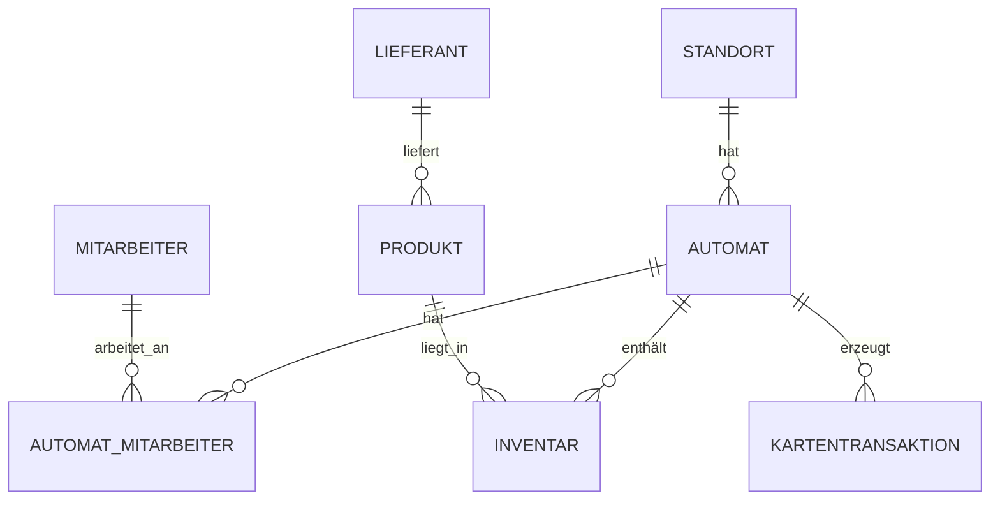

## Einleitung

Dieses Skript ist von Herrn Vöhringer für den SAE Unterricht im 2. Lehrjahr der Fachinformatiker an der Gewerbreschule Villingen-Schwenningen.

Es ist eine Ergänzung zum Unterricht und gleichzeitig eine kompakte Zusammenfassung für Klassenarbeiten und Prüfungen, ist aber in keinster Weise vollständig. Es basiert auf der Warenautomat-Datenbank.

Die Datenbank bildet einen Verkaufsautomaten-Betrieb ab. Zentrales Element sind die Verkaufsautomaten, die an verschiedenen Standorten stehen und von Mitarbeitern betreut werden. In jedem Automaten befinden sich ein Inventar aus Produkten, die von Lieferanten eingekauft werden.

### Überblick über die Warenautomat-Datenbank

Das Diagramm zeigt die wichtigsten Beziehungen: Ein Standort kann mehrere Automaten haben, ein Lieferant kann mehrere Produkte liefern, und Automaten sowie Mitarbeiter oder Produkte werden über Zwischentabellen bzw. Fremdschlüssel verbunden.

### Themenübersicht und Querverweise

Die folgenden Kapitel bauen inhaltlich aufeinander auf und können auch gezielt zum Nachschlagen einzelner Themen verwendet werden.

#### Grundlagen und Modellierung
- [Kapitel 1: Einstieg in Datenbanken](01_Einstieg_in_Datenbanken.md)
- [Kapitel 2: Datenbankmodelle](02_Datenbankmodelle.md)
- [Kapitel 3: Primärschlüssel, Fremdschlüssel, Relationenschreibweise und Datenintegrität](03_Primärschlüssel_Fremdschlüssel_Relationenschreibweise_und_Datenintegrität.md)
- [Kapitel 4: ER-Modell nach Chen und Crow's Foot Notation mit ER-Übungen](04_ER-Modell_nach_Chen_und_Crows_Foot_Notation_mit_ER-Übungen.md)
- [Kapitel 5: Anomalien und Normalisierung](05_Anomalien_und_Normalisierung.md)

#### SQL-Grundlagen und Datenstruktur
- [Kapitel 6: SQL-Felddatentypen](06_SQL-Felddatentypen.md)
- [Kapitel 7: CREATE TABLE](07_CREATE_TABLE.md)
- [Kapitel 8: INSERT INTO](08_INSERT_INTO.md)
- [Kapitel 9: SQL SELECT-Grundlagen](09_SQL_SELECT-Grundlagen.md)
- [Kapitel 10: Rechenoperatoren in SQL und Aliase](10_Rechenoperatoren_in_SQL_und_Aliase.md)

#### Abfragen und Auswertungen
- [Kapitel 11: JOINs und Mehrfach-JOINs](11_JOINs_und_Mehrfach-JOINs.md)
- [Kapitel 12: GROUP BY und Aggregatsfunktionen](12_GROUP_BY_und_Aggregatsfunktionen.md)
- [Kapitel 13: HAVING](13_HAVING.md)
- [Kapitel 14: Subqueries](14_Subqueries.md)

#### Datenänderung und Sicherheit
- [Kapitel 15: UPDATE, ALTER und DELETE](15_UPDATE_ALTER_und_DELETE.md)
- [Kapitel 16: SQL Injection](16_SQL_Injection.md)