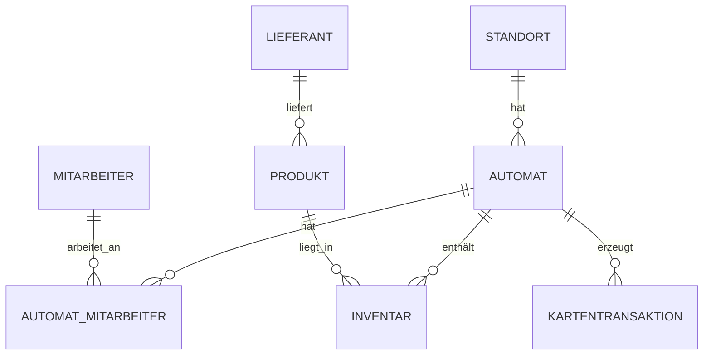

## Einleitung

Dieses Skript ist eine Ergänzung zum Unterricht und gleichzeitig eine kompakte Zusammenfassung für Klassenarbeiten und Prüfungen. Es basiert auf der Warenautomat-Datenbank.

Die Datenbank bildet einen realistischen Verkaufsautomaten-Betrieb ab. Im Mittelpunkt stehen Standorte, Automaten, Mitarbeiter, Lieferanten, Produkte, Inventar und Kartentransaktionen. Dadurch lassen sich die wichtigsten SQL-Themen an einem durchgängigen Beispiel erklären und üben.

### Überblick über die Warenautomat-Datenbank

Das Diagramm zeigt die wichtigsten Beziehungen: Ein Standort kann mehrere Automaten haben, ein Lieferant kann mehrere Produkte liefern, und Automaten sowie Mitarbeiter oder Produkte werden über Zwischentabellen bzw. Fremdschlüssel verbunden.

### Querverweise
- [Überblick über die Warenautomat-Datenbank](#überblick-über-die-warenautomat-datenbank)
- [Kapitel 1: Einstieg in Datenbanken](01_Einstieg_in_Datenbanken.md)
- [Kapitel 4: ER-Modell nach Chen und Crow's Foot](04_ER-Modell_nach_Chen_und_Crows_Foot_Notation_mit_ER-Übungen.md)

